# Django-Blog-Application
> [!NOTE]
> Overview: A blog application was designed and developed to allow users to efficiently explore and view detailed posts. Included features like SEO-friendly URLs, pagination, and a comment system to boost user engagement. A third-party tagging system was integrated for enhanced content categorization, and full-text search was implemented to improve search functionality. The application was deployed using Docker Compose.

> [!TIP]
> 
> References:
> * Django documentation [^django-documentation]
> 
> * Django 5 by example book [^django-5-by-example-book]
## Demo
> [!NOTE]
> 
> Video demo

## Requirements
| Packages | Description |
|----------|-------------|
| [`python-decouple`](https://pypi.org/project/python-decouple/)| This library simplifies the use of environment variables in the projects|
| `psycopg` | Psycopg is a popular Python library for connecting to and working with PostgreSQL databases.|
| `pillow` | Pillow is the de facto standard library for image processing in Python. It supports multiple image formats and provides powerful image processing functions. Pillow is required by Django to handle images with ImageField.|
| `Markdown`| Markdown is a plain-text formatting syntax that is very simple to use, and it’s intended to be converted into HTML. You can write posts using simple Markdown syntax and get the content automatically converted into HTML code. Learning Markdown syntax is much easier than learning HTML|
| `django-taggit`|django-taggit is a reusable Django application designed to make adding tagging to your project easy and fun.|
| `django-extensions`| Django Extensions is a collection of custom extensions for the Django Framework.|
| `django-debug-toolbar` | The Django Debug Toolbar is a configurable set of panels that display various debug information about the current request/response and when clicked, display more details about the panel's content.|

* Using the Django authentication framework: `django.contrib.auth`

## Run project in local development
```bash
# Setup database (PostGreSQL and create .env file)
git clone https://github.com/Bombbom/Blog-application.git
pip install -r requirements.txt
cd mysite/
python3 manage.py runserver --settings=mysite.settings.local
```
## Quick deploy
```bash
git clone https://github.com/Bombbom/Blog-application.git
docker compose up
```
## Project Explanation Overview
- Project name: `mysite`
- Project application: `account`, `blog`
- Account:
  - login
  - logout
  - change password
  - reset password
  - register 
  - edit account profiles
- Blog
  - Model: Post, Comment, Tag (third-party Models), ...
  - View all post 
  - View detail post
  - Search post 
  - Create Post 
  - ....
## Features demo

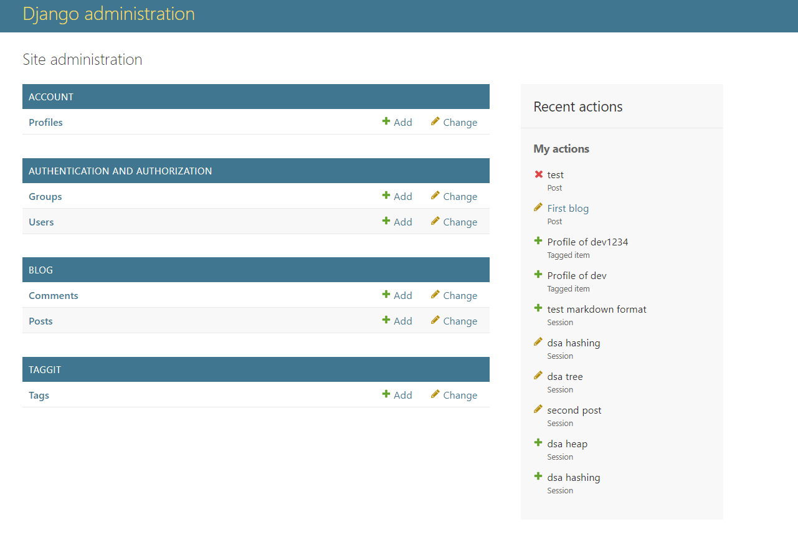

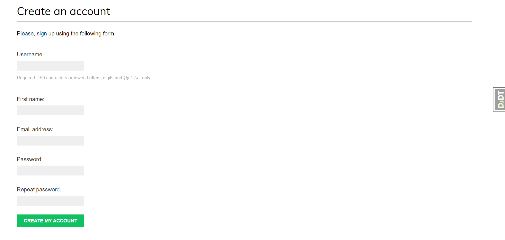

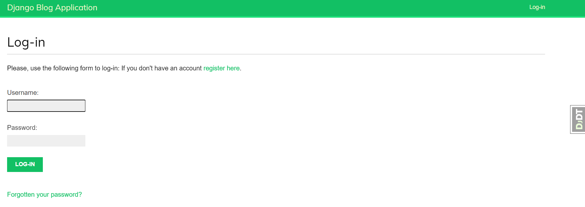

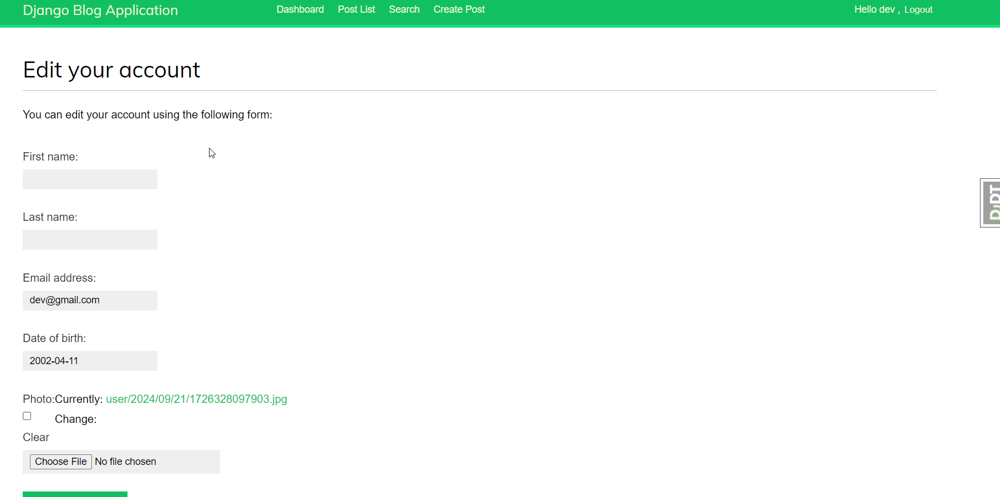

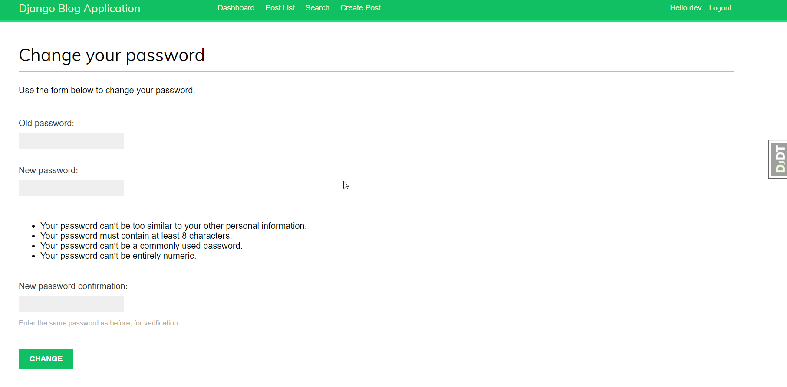

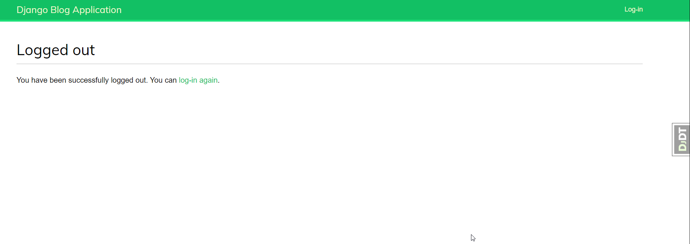

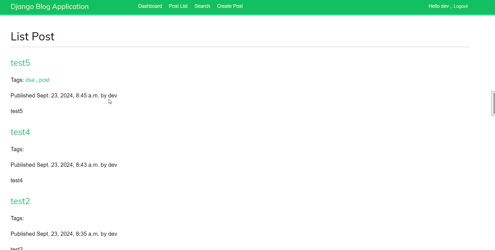

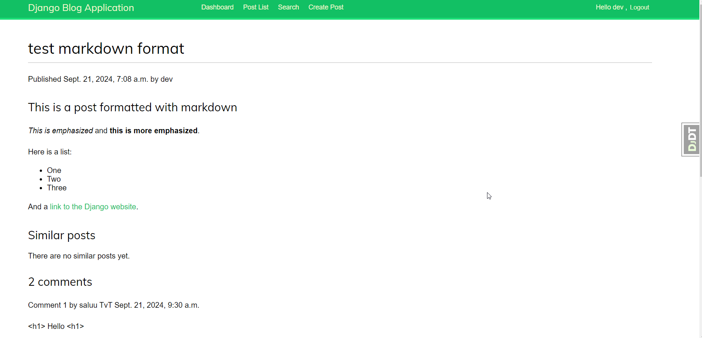

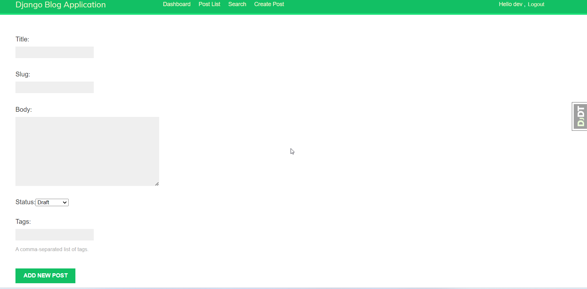

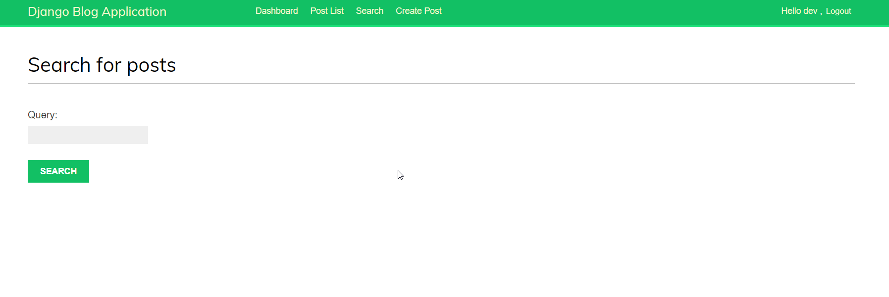

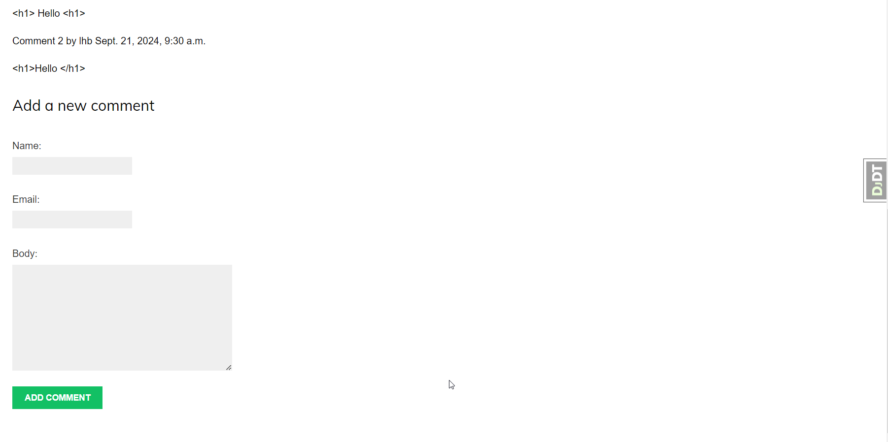


## Future
- [ ] Write Test for projects
- [ ] Add security feature in projects
- [ ] Pentesting the projects.
- [ ] Update front-end (e.g using Bootstrap, ...)
- [ ] Update deploy
- [ ] Deploy a project in Cloud (e.g Azure, Heroku, ...)

## Resources 
[^django-documentation]: https://docs.djangoproject.com/en/5.1/
[^django-5-by-example-book]: https://www.packtpub.com/en-ph/product/django-5-by-example-9781805125457?srsltid=AfmBOoogjs_4T-aF_aynz_cKDu3-aofsvCeIDcP_Ql0iig7Y0STMXLS-